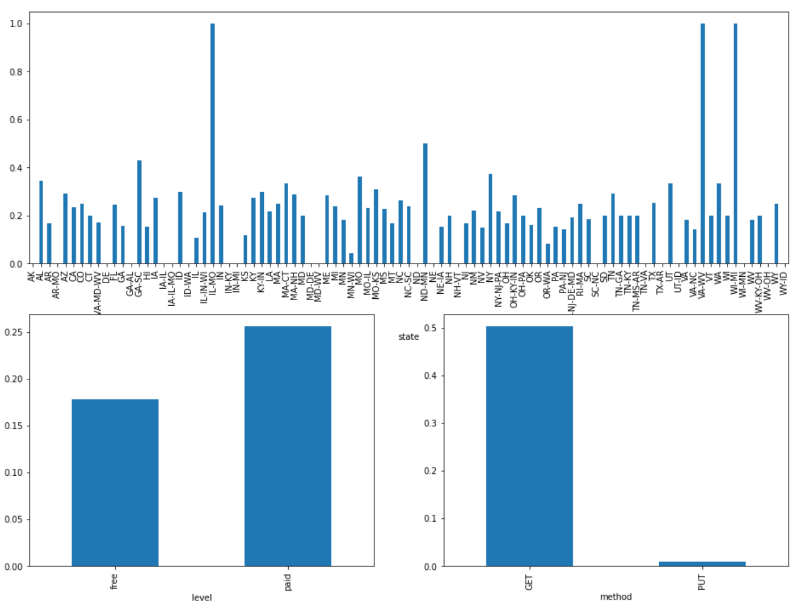
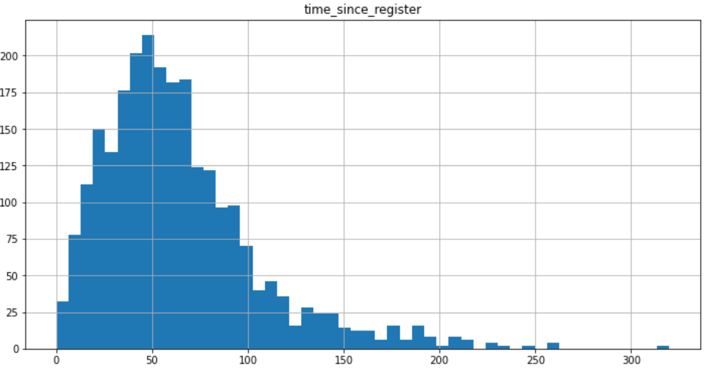
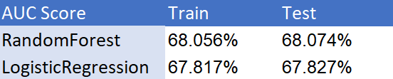

# Sparkify_capstone

This repo contains the code for my Sparkify capstone project. For more details and findings please refer to my [Blog](https://bigyi1989-93881.medium.com/sparkify-churn-rate-bdd4baae5021).


## Structure
 ```bash
├── Sparkify_Capstone.ipynb: main notebooks that contain all my code. This is directly download from EMR.
├── README.md
└── .gitignore
 ```

## Data Overview


## Model Result 


